# software-project-cost-management-system
基于SSM框架实现的，以阶段和任务统计的软件工程项目成本控制管理系统

### 购买方
#### 项目分析
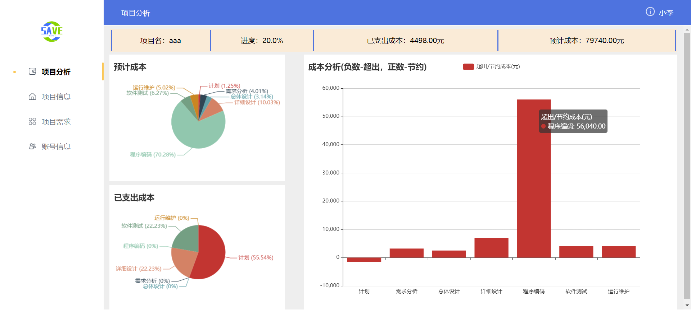
#### 项目信息
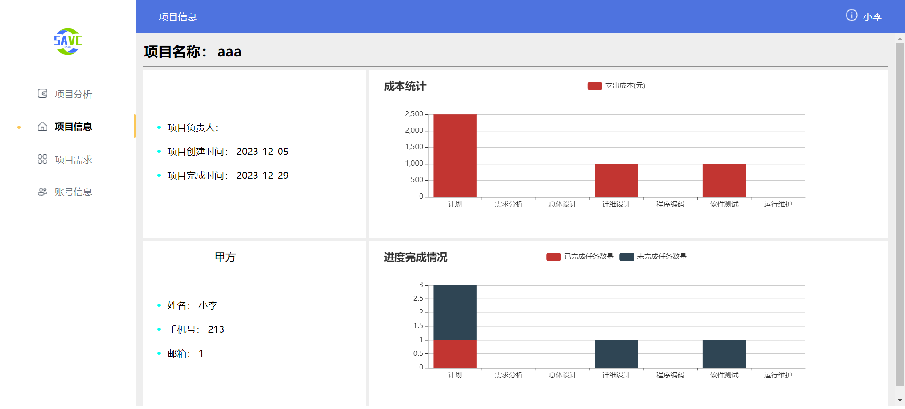
#### 项目需求

#### 账号信息
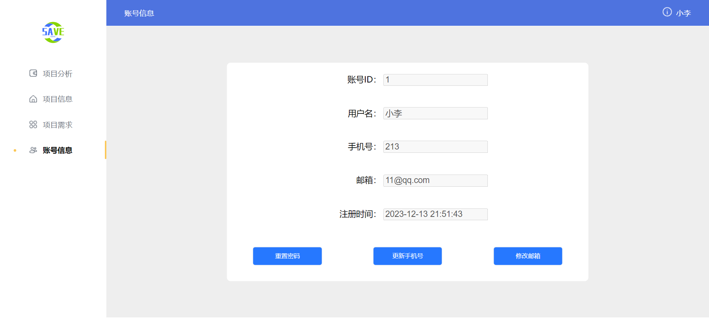

### 项目经理
#### 项目汇总
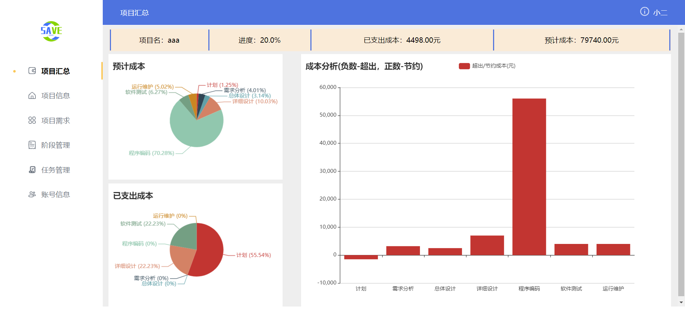
#### 项目信息
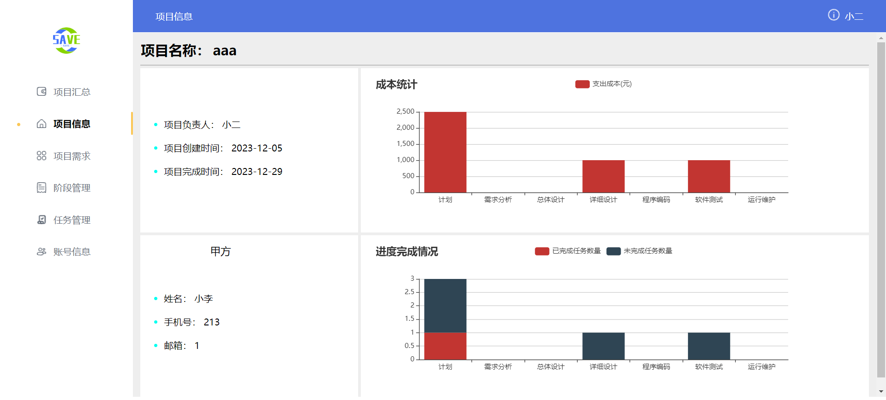
#### 项目需求
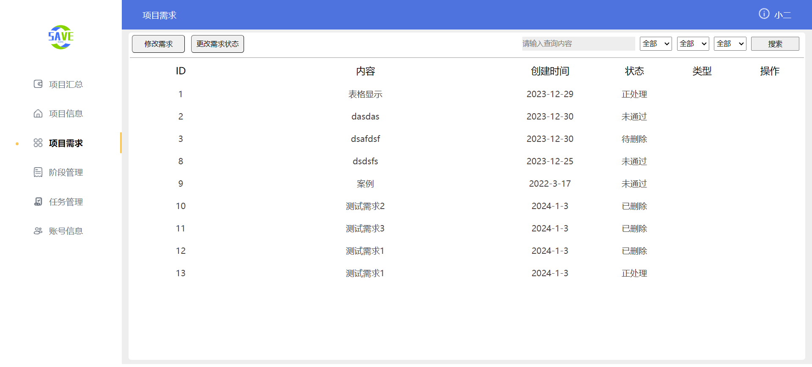
#### 阶段管理
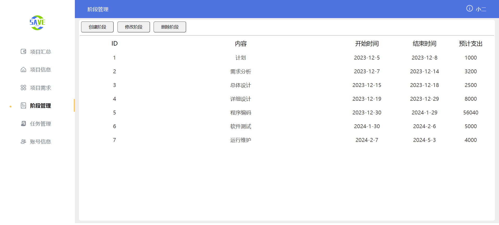
#### 任务管理
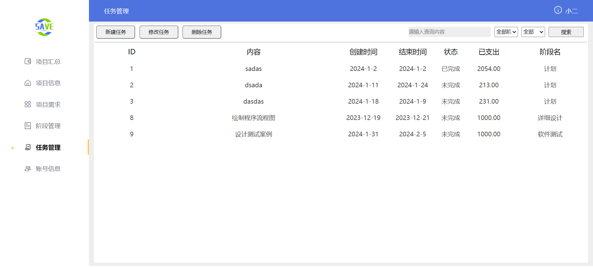
#### 账号信息
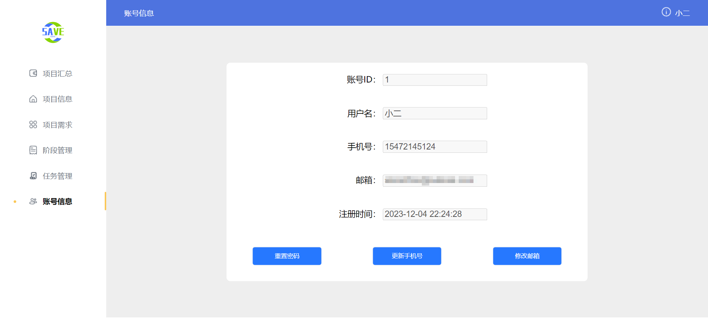

### 系统管理员
#### 用户管理
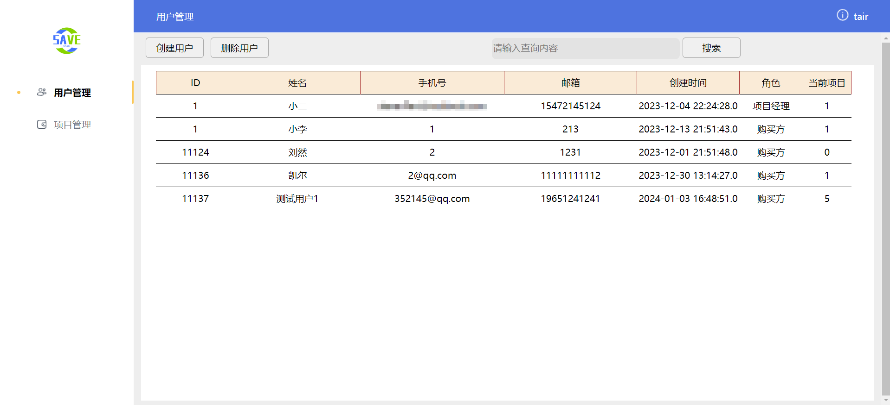
#### 项目管理
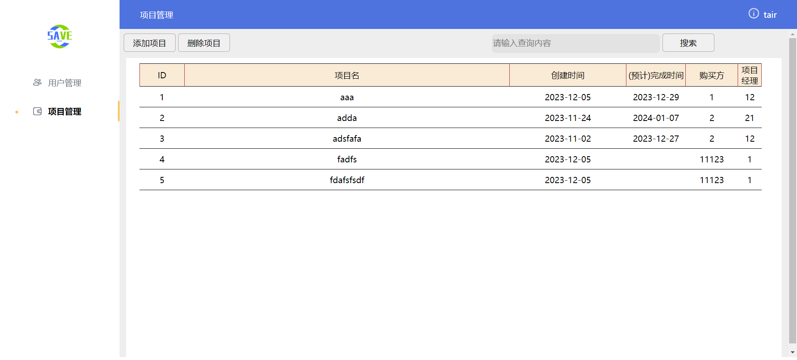